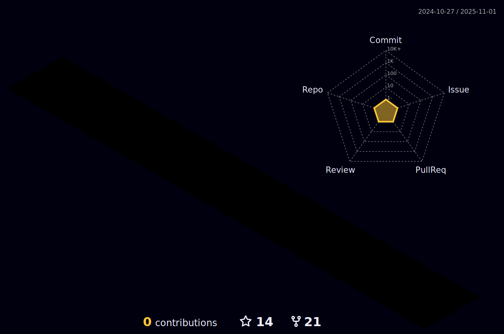

<link rel="stylesheet" type="text/css" href="Readme.css">
<!-- 动态打字效果 -->
<h1 align="center">
  <a href="https://MikasaEureka.github.io/">
    
  </a>
</h1>

<div align="center" float="center" >
  <!-- 贪吃蛇代码贡献图 -->
  
  <!-- 敲代码的图片 -->
  
</div>
<br>  

<!-- 个人资料徽标 -->
<div align="center">
  <h1> 😶‍🌫️
  <a href="https://MikasaEureka.github.io/"></a>&emsp;
  <a href="https://twitter.com//"></a>&emsp;
  <a href="https://www.facebook.com/profile.php?id=/"></a>&emsp;
  <a href="https://www.youtube.com/channel/"></a>&emsp;
  <a href="https://blog.csdn.net//"></a>&emsp;
  <a href="https://space.bilibili.com/181965098"></a>&emsp;
  <a href="https://www.zhihu.com/people/mikasaeureka"></a>&emsp;
<!-- 访客数统计徽标 -->
  
  </h1>
</div>

<p>✍️&nbsp;&nbsp;大家好，我是MikasaEureka <s>叫我M神我也能接着</s> ! 目前就读于？？，热爱前沿科技，励志成为<b>世界首富</b>!</p>
<p>&emsp;&emsp;I... a universe of atoms, an atom in the universe.</p>
<p>&emsp;&emsp;I would rather have questions that can't be answered than answers that can't be questioned. I have no responsibility to be like they expect me to be. We are trying to prove ourselves wrong as quickly as possible, because only in that way can we find progress.</p>  

----

> 搭配GitHub acitons更新profile参考   
https://github.com/yoshi389111/github-profile-3d-contrib  
https://github.com/Platane/snk 
----

<!-- 比较好的开源项目卡片 -->
<div align="center">
<a href="https://github.com/MikasaEureka/Msg-Bots">
  </a>
<a href="https://github.com/MikasaEureka/L0CV-web">
  </a>
<a href="https://github.com/MikasaEureka/keepalive-workflow">
  </a>
</div>


💪 正在学习: 

&emsp;&emsp;


🧠 计划学习:

&emsp;&emsp;


🧰 常用的工具:

&emsp;&emsp; 


## 🚀 Achievements

<!-- 连续提交代码天数记录 -->
<div align="center">
  
  
  
</div>
<br>

<!-- Dynamic Quotes -->
<div align="center"></div>

<!-- GitHub奖杯🏆 -->
<div align="center"></div>
<br>

<!-- GitHub数据统计 -->
<div align="center">
  
  
</div>
<br>


<!-- profile-3d-contrib -->
<div align="center" >
  
  
  <!--img width="50%" src="https://activity-graph.herokuapp.com/graph?username=MikasaEureka&theme=xcode&bg_color=FF000000&hide_border=true" /-->
</div>

# 🎯 [𝙼𝚎𝚝𝚛𝚒𝚌𝚜](https://github.com/lowlighter/metrics/blob/master/.github/readme/partials/documentation/setup/action.md)

<div>


<div align="left" width="40%">
<!-- wakatime 统计 -->  
  
[**Waka Time**](https://github.com/anmol098/waka-readme-stats) 
<!--START_SECTION:waka-->
**I'm an Early 🐤** 

```text
🌞 Morning                372 commits         █████████████░░░░░░░░░░░░   52.77 % 
🌆 Daytime                135 commits         █████░░░░░░░░░░░░░░░░░░░░   19.15 % 
🌃 Evening                139 commits         █████░░░░░░░░░░░░░░░░░░░░   19.72 % 
🌙 Night                  59 commits          ██░░░░░░░░░░░░░░░░░░░░░░░   08.37 % 
```
📅 **I'm Most Productive on Monday** 

```text
Monday                   134 commits         █████░░░░░░░░░░░░░░░░░░░░   19.01 % 
Tuesday                  127 commits         █████░░░░░░░░░░░░░░░░░░░░   18.01 % 
Wednesday                60 commits          ██░░░░░░░░░░░░░░░░░░░░░░░   08.51 % 
Thursday                 82 commits          ███░░░░░░░░░░░░░░░░░░░░░░   11.63 % 
Friday                   99 commits          ████░░░░░░░░░░░░░░░░░░░░░   14.04 % 
Saturday                 119 commits         ████░░░░░░░░░░░░░░░░░░░░░   16.88 % 
Sunday                   84 commits          ███░░░░░░░░░░░░░░░░░░░░░░   11.91 % 
```


📊 **This Week I Spent My Time On** 

```text
🕑︎ Time Zone: Asia/Shanghai

💬 Programming Languages: 
No Activity Tracked This Week

🔥 Editors: 
No Activity Tracked This Week

💻 Operating System: 
No Activity Tracked This Week
```


 Last Updated on 12/08/2024 00:46:58 UTC
<!--END_SECTION:waka-->
<!-- Gif -->
<div align="center" width="55%">
  
  
  
  
  
  
  
  
  
</div>
</div>
</div>


